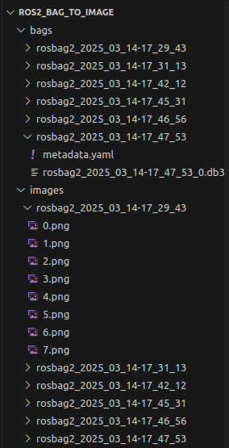
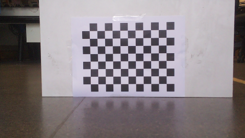

# ROS2 Bag To Image

This is a simple ROS2 node that opens bag files from `bags/`, looks for the topic `/camera/image_raw`, then saves the image to `/images` under the same bag name and image index, ordered by when the images are read by the bag. While completing this operation, the node will also publish the image to `/image` for real-time monitoring if necessary.

## Installation

To install, run the following code:

```
cd ~/ros2_ws/src
git clone git@github.com:sepehrsaryazdi/ros2_bag_to_image.git
cd ..
colcon build --packages-select ros2_bag_to_image
source install/setup.bash
```

## Usage

To use this package, place the desired bags in `~/ros2_ws/src/ros2_bag_to_image/bags/` and delete `~/ros2_ws/src/ros2_bag_to_image/images/`. Ensure that the `$HOME` path variable is set correctly. Then, run the following:

```
ros2 run ros2_bag_to_image ros2_bag_to_image
```

## Example

By default, this package comes with a few ROS bags recorded from the Turtlebot3 burger robot, placed at various angles and distances relative to a checkerboard. After running, the following code will display:

<p align="center">

</p>

Opening one of these images will look like:

<p align="center">

</p>

